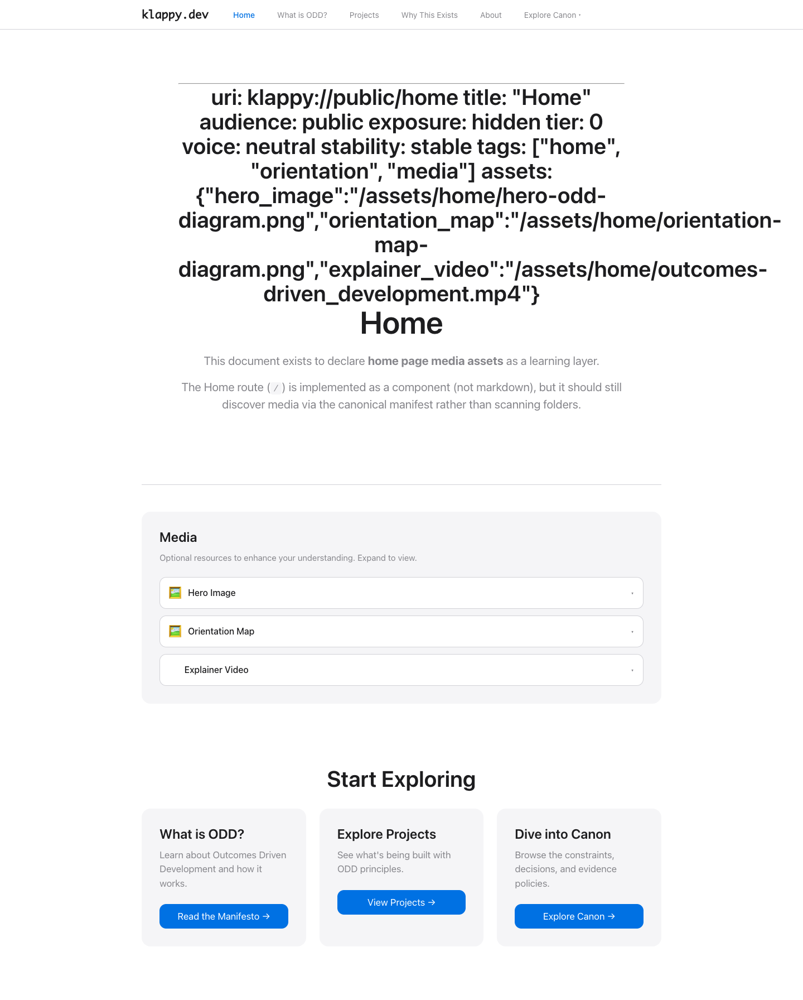
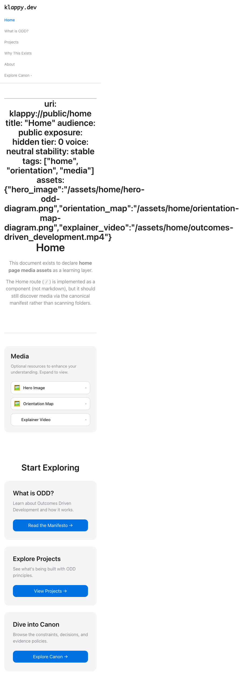
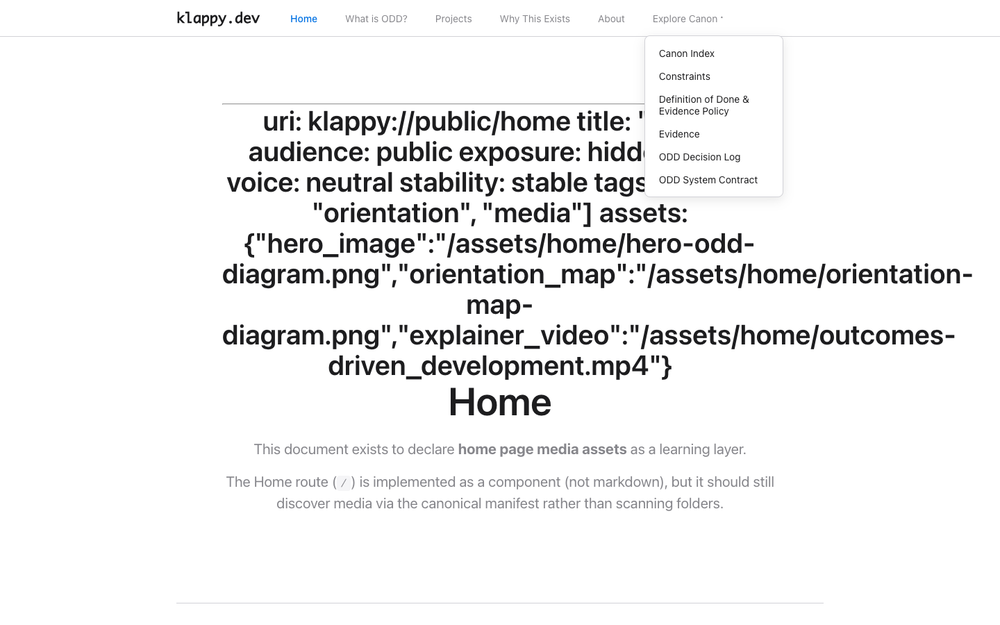

# Evidence (Run b497df0e)

## Visual Proof

This attempt includes 4 screenshots demonstrating key PRD requirements.

### Desktop Homepage (1440x900)

**Demonstrates:**
- ≤7 navigation items (6 items shown: Home, What is ODD?, Projects, Why This Exists, About, Explore Canon)
- Progressive disclosure (Canon submenu collapsed by default)
- Visual calm with Apple 2025 design principles
- Clear CTA cards for key entry points

### Mobile Homepage (375x667)

**Demonstrates:**
- Mobile usability without horizontal scrolling
- Responsive navigation that adapts to narrow viewports
- Touch-friendly button sizes and spacing

### Content Page - ODD Manifesto (1440x900)

**Demonstrates:**
- Markdown rendering with proper typography
- Resource metadata (tier badges, audience indicators)
- Tag display
- Deep linking to specific content

### Expanded Navigation (1440x900)

**Demonstrates:**
- Progressive disclosure in action (Canon submenu expanded)
- Secondary navigation reveals tier 1 canon resources
- Smooth dropdown interaction

## Success Criteria Met

- [x] First load shows ≤7 nav items (6 shown)
- [x] Mobile usable without horizontal scrolling (verified at 375px)
- [x] Canon discoverable without file paths exposed (via manifest.json)
- [x] No agent instructions in UI (human-friendly language only)
- [x] No CLI/process language exposed
- [x] Deep links work (URL reflects resource)
- [x] Progressive disclosure tiers respected (Tier 0/1/2 via frontmatter)

## Build Info

- **Build tool:** Vite 6.4.1
- **Output size:** ~194KB JS + ~11KB CSS (gzipped: ~62KB total)
- **Build time:** 1.31s
- **Content resources:** 59 markdown files served via manifest.json
