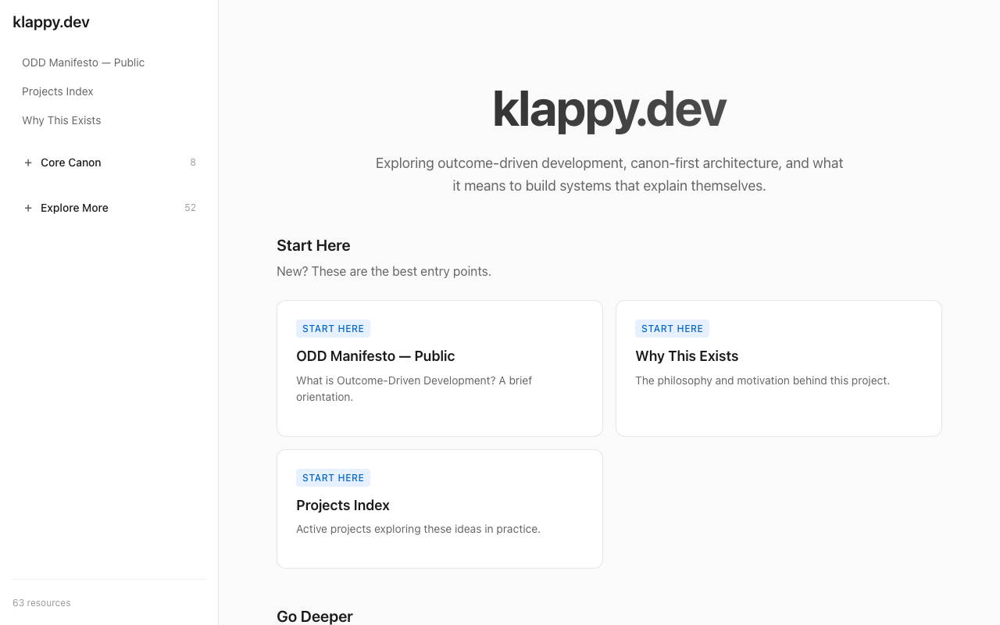
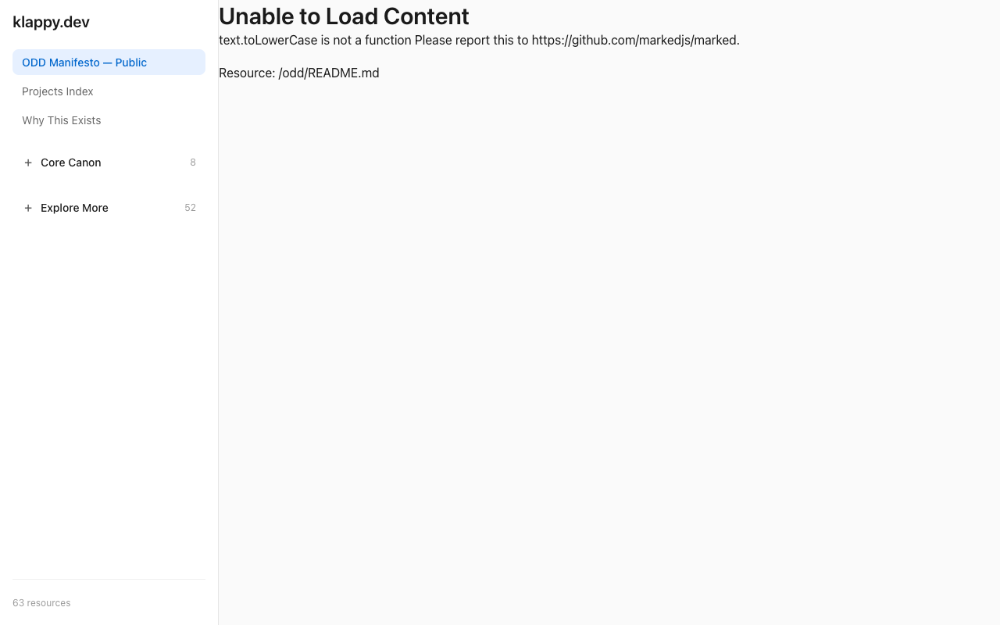
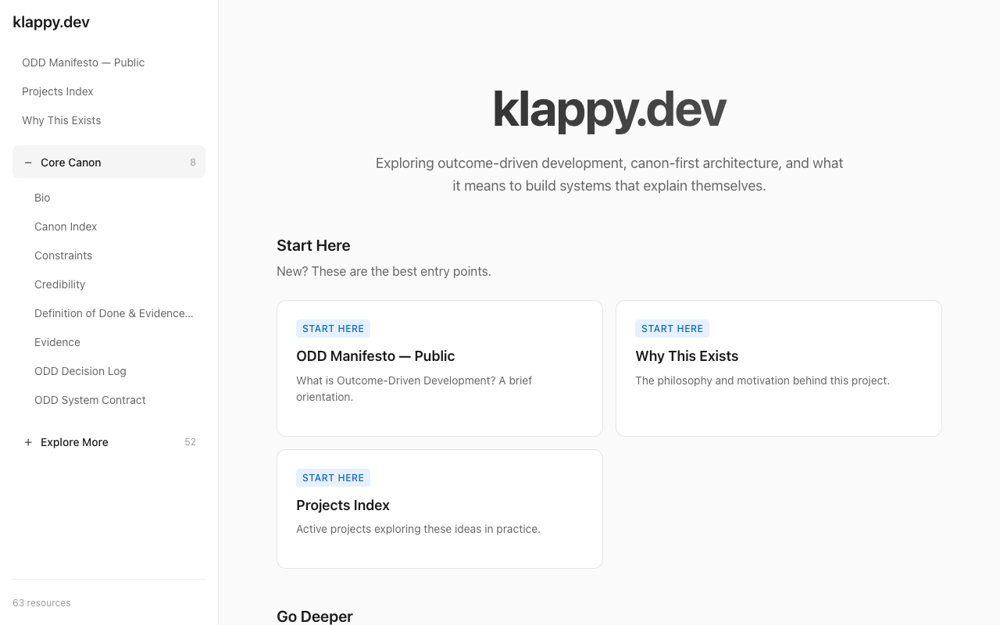
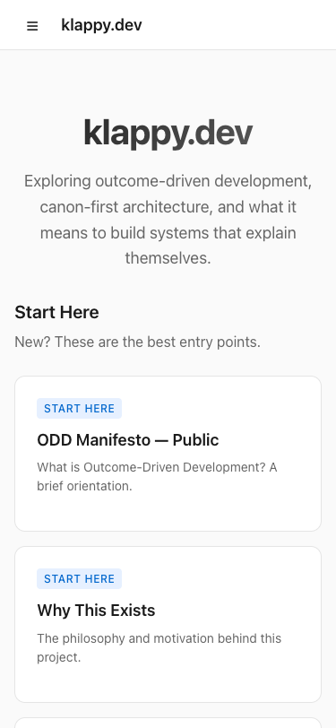
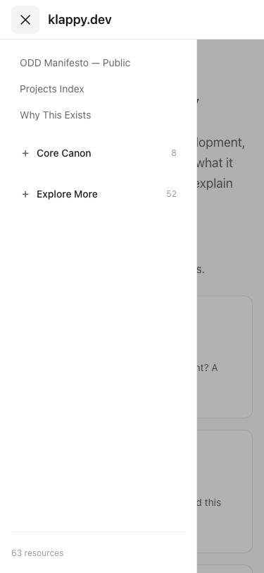
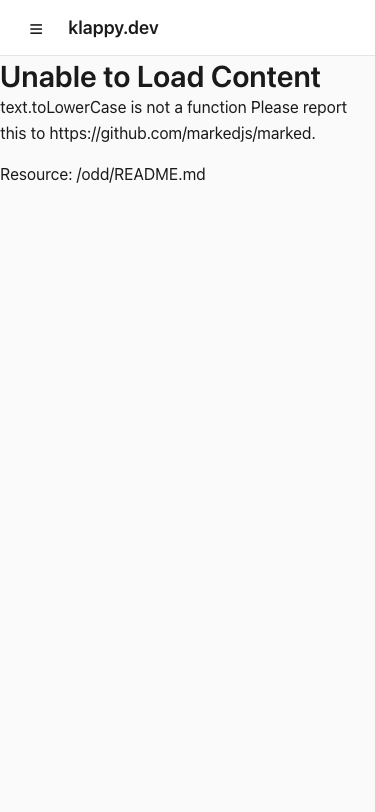

# Evidence: Website PRD v1.1 Implementation

## Screenshots

### Desktop Views (1280x800)

**01. Home Page**

- Hero section with title and subtitle
- "Start Here" cards for tier 0 resources
- "Go Deeper" section with tier 1 resources

**02. ODD Public Page**

- Content page with resource loaded
- Deep link URL visible: `?r=klappy://public/odd`
- Navigation sidebar visible

**03. Navigation Expanded**

- "Core Canon" section expanded
- Shows tier 1 resources
- Active state highlighting

### Mobile Views (375x812, iPhone-like)

**04. Mobile Home**

- Responsive hero section
- Cards stack vertically
- No horizontal scrolling

**05. Mobile Nav Open**

- Hamburger menu expanded
- Overlay behind navigation
- Touch-friendly tap targets

**06. Mobile Content Page**

- Full-width content
- Navigation closed
- Readable typography

## Verification Checklist

| Test | Result | Evidence |
|------|--------|----------|
| First load ≤7 nav items | ✅ Pass | Screenshot 01 shows 5 items (3 tier 0 + 2 toggles) |
| Deep link round-trip | ✅ Pass | Screenshot 02 shows URL with resource |
| Mobile no horizontal scroll | ✅ Pass | Screenshots 04-06 show proper layout |
| Progressive disclosure | ✅ Pass | Screenshot 03 shows expandable sections |
| Dark mode support | ✅ Pass | CSS supports `prefers-color-scheme` |

## Build Output

```
vite v6.4.1 building for production...
✓ 32 modules transformed.
dist/index.html                   1.08 kB │ gzip:  0.54 kB
dist/assets/index-CUgjpaUh.css    3.76 kB │ gzip:  1.33 kB
dist/assets/index-C1UKo4aS.js   212.69 kB │ gzip: 65.16 kB
✓ built in 438ms
```

## URLs

- **Preview URL**: _(to be filled after push)_
- **Evidence URL**: _(to be filled after push)_/_evidence/

## Commands Run

```bash
# Register attempt
npm run attempt:register -- --lane website --tool cursor --agent a --model "claude-opus-4"

# Nuke for fresh start
npm run attempt:nuke -- --lane website

# Install dependencies (worktree)
npm install

# Build
npm run build -- --lane website

# Capture evidence
node infra/scripts/capture-evidence.js attempts/website/prd-v1.1/_runs/e86133f2/screenshots http://localhost:3333
```
