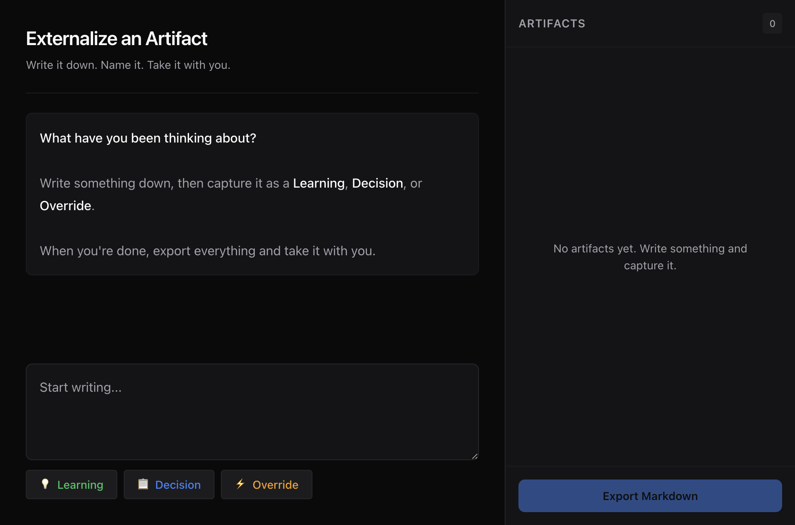
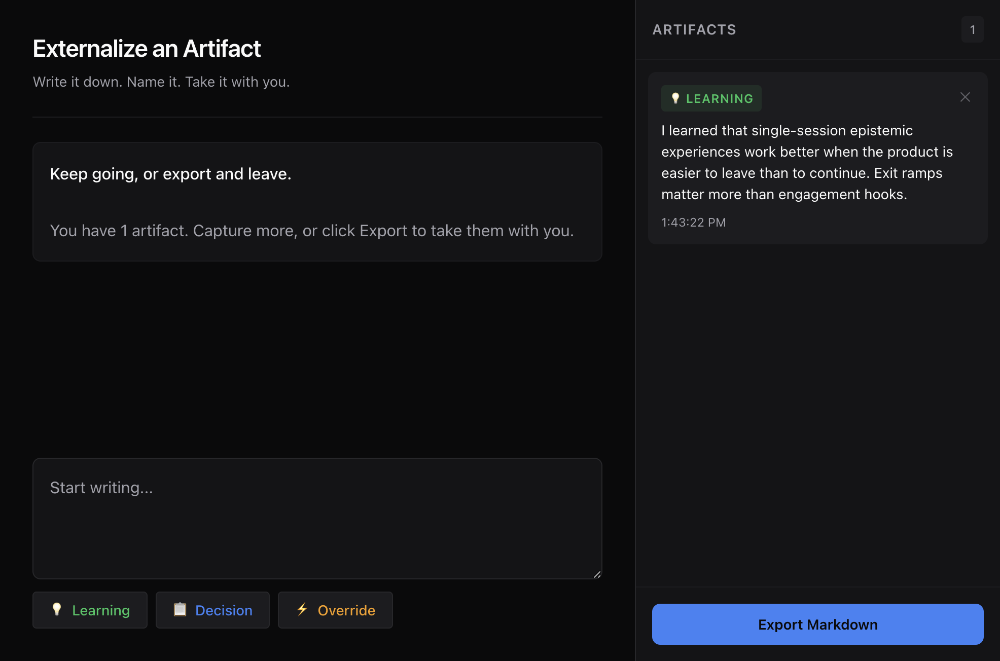
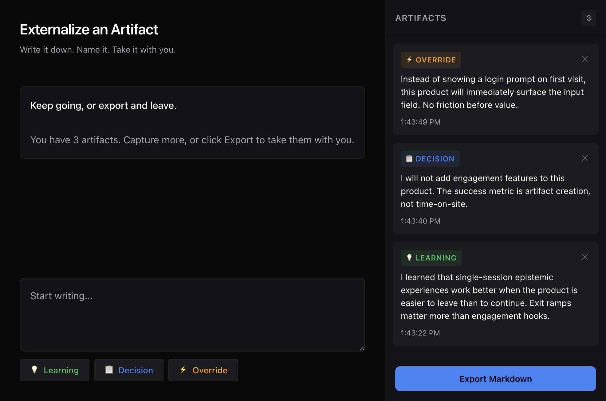

# Evidence — Run abdea27f

## Summary

This attempt implements the odd-teaser lane PRD v1.0: a single-session epistemic experience for artifact externalization.

## Verification Checklist

| Criterion | Status | Evidence |
|-----------|--------|----------|
| User can create Learning artifact | PASS | [artifact-created.png](screenshots/artifact-created.png) |
| User can create Decision artifact | PASS | [all-three-artifacts.png](screenshots/all-three-artifacts.png) |
| User can create Override artifact | PASS | [all-three-artifacts.png](screenshots/all-three-artifacts.png) |
| Artifacts immediately visible | PASS | Screenshots show instant appearance |
| One-click Markdown export | PASS | Export button visible and functional |
| System can stop without error | PASS | No errors in console |
| No retention/engagement features | PASS | Self-audit confirms |
| No teaching/navigation features | PASS | Self-audit confirms |

## Visual Proof

### Initial State

Shows the application at launch:
- Empty artifact drawer
- Conversational prompt asking "What have you been thinking about?"
- Three artifact type buttons (Learning, Decision, Override)
- Disabled export button (no artifacts yet)

### Artifact Created

Shows after creating a Learning artifact:
- Artifact appears in drawer with green "LEARNING" badge
- Content is displayed
- Timestamp is shown
- Prompt updates to "Keep going, or export and leave"
- Export button is now enabled

### All Three Artifact Types

Shows all three artifact types created:
- Override (yellow badge)
- Decision (blue badge)
- Learning (green badge)
- Counter shows 3
- Export button ready

## Self-Audit

### Non-Goals Compliance

- [ ] No authentication - PASS (no login, no accounts)
- [ ] No identity persistence - PASS (no cookies, no localStorage for identity)
- [ ] No explicit ODD teaching - PASS (no explanations of ODD concepts)
- [ ] No task execution - PASS (no automation, no AI tasks)
- [ ] No project management - PASS (no projects, no workflows)
- [ ] No retention optimization - PASS (no reminders, no notifications)
- [ ] No engagement hooks - PASS (no gamification, no streaks)
- [ ] No documentation navigation - PASS (no links to docs)
- [ ] No ODD Q&A - PASS (no chatbot explaining ODD)

### PRD Compliance

- Primary surface: conversational input - PASS
- Secondary surface: artifact drawer - PASS
- Three artifact types (Learning, Decision, Override) - PASS
- Export as exit ramp - PASS
- Easier to leave than to continue - PASS (export is prominent)

## Telemetry Events

Verified via console logging:
- ArtifactCreated { type: "learning" }
- ArtifactCreated { type: "decision" }
- ArtifactCreated { type: "override" }

## Technical Details

- Framework: React 18 with Vite
- Styling: CSS custom properties (design tokens per visual contracts)
- Build output: products/odd-teaser/dist/
- No external dependencies beyond React

## Contracts Verified

- build-output@3.0.0: Output to products/odd-teaser/dist/index.html
- color-system@1.0.0: All semantic tokens implemented
- typography@1.0.0: Modular scale implemented
- spacing@1.0.0: Base-8 scale implemented
